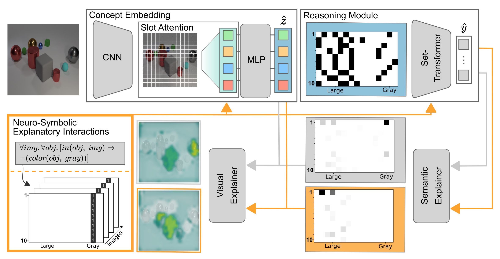

# NeSyXIL (Neuro-Symbolic Explanatory Interactive Learning)

This is the official repository of the article: [Right for the Right Concept: Revising Neuro-Symbolic Concepts by 
Interacting with their Explanations](https://arxiv.org/pdf/2011.12854.pdf) by Wolfgang Stammer, Patrick Schramowski, 
Kristian Kersting, published at CVPR 2021.

This repository contains all source code required to reproduce the experiments of the paper including the ColorMNIST 
experiments and running the CNN model. 

In case you are only looking for the NeSy Concept Learner please visit the 
separate [repository](https://github.com/ml-research/NeSyConceptLearner).



Included is a docker file as well as a modified version of captum ([official repo](https://captum.ai/)) that we had 
modified by a single line such that the gradients of the explanations are kept. Simply running the docker file will 
automatically install the captum_xil version. (ref. line 105 in ```NeSyXIL/src/docker/captum_xil/captum/attr/_utils/gradient.py```) 

## How to Run:

### CLEVR-Hans

#### Dataset

Please visit the [CLEVR-Hans](https://github.com/ml-research/CLEVR-Hans) repository for instrucitons on how to download 
the CLEVR-Hans dataset.

### NeSy Concept Learner

We have moved the source code for the NeSy Concept Learner to a separate 
[repository](https://github.com/ml-research/NeSyConceptLearner) in case someone is only interested in the Concept 
Learner for their work. In order to reproduce our experiments please clone this repository first:

1. ```cd src/clevr_hans/nesy_xil/```

2. ```git clone https://github.com/ml-research/NeSyConceptLearner.git```

### Docker

We have attached a Dockerfile to make reproduction easier. We further recommend to build your own docker-compose file
based on the DockerFile. To run without a docker-compose file:

1. ```cd src/docker/```

2. ```docker build -t nesy-xil -f Dockerfile .```

3. ```docker run -it -v /pathto/NeSyXIL:/workspace/repositories/NeSyXIL -v /pathto/CLEVR-Hans3:/workspace/datasets/CLEVR-Hans3 --name nesy-xil --entrypoint='/bin/bash' --runtime nvidia nesy-xil```

### NeSy XIL experiments

We have included the trained NeSy Concept Learner files for seeds 0 (or 1 for the global rule). To reproduce the NeSy 
XIL results please run the desired script e.g. as

```cd src/clevr_hans/nesy_xil/```

```./scripts/clevr-hans-concept-learner-xil_global.sh 0 100 /workspace/datasets/CLEVR-Hans3/```

For training with the RRRLoss on CLEVR-Hans3 with GPU 0 and run number 100. This corresponds to the setting of our 
experiments on the global correction rule.

### CNN experiments

We have included the trained CNN model files for seed 0. To reproduce the CNN experiments please runs the desired 
scripts e.g. as 

```cd src/clevr_hans/cnn/```

```./scripts/clevr-hans-resnet-xil.sh 0 0 /workspace/datasets/CLEVR-Hans3/```

For training with the HINTLoss on CLEVR-Hans3 with GPU 0 and run number 0.

### ColorMNIST

For running the ColorMNIST experiment with the provided dockerfile:

1. ```cd src/color_mnist/data/```

2. ```python generate_color_mnist.py```

3. ```cd ..```

4. ```./scripts/color_mnist_train.sh 0``` for running the default experiment on GPU 0.

## Citation
If you find this code useful in your research, please consider citing:

> @InProceedings{Stammer_2021_CVPR,
    author    = {Stammer, Wolfgang and Schramowski, Patrick and Kersting, Kristian},
    title     = {Right for the Right Concept: Revising Neuro-Symbolic Concepts by Interacting With Their Explanations},
    booktitle = {Proceedings of the IEEE/CVF Conference on Computer Vision and Pattern Recognition (CVPR)},
    month     = {June},
    year      = {2021},
    pages     = {3619-3629}
}
}
